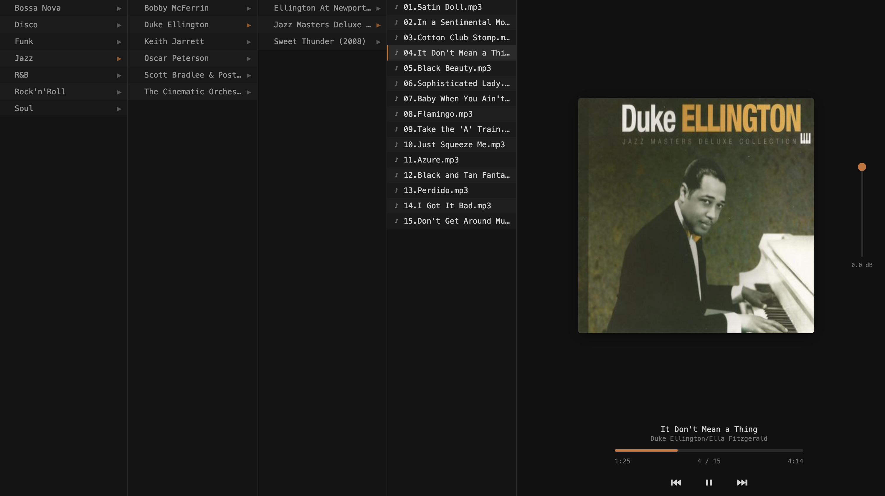

<p align="center">
  
</p>

<h1 align="center">love</h1>

<p align="center">
  Self-hosted web music player that mirrors the folder-browsing experience of a hardware DAP.
  <br>
  No playlists, no library indexing — just traverse the folder tree and play.
</p>



## Why

Every music app tries to be smart — indexing, playlisting, recommending. But on a hardware player like the FiiO X1 II or xDuo X34001, the experience is simpler: you organized your folders by genre, artist, album, and you just browse that tree. That's the whole interaction model, and it works because the organization is already yours.

No existing self-hosted player preserves this. Love does.

## Features

- **Miller column navigation** — Finder-style column view of your music folder tree
- **Keyboard-first** — vim keys (hjkl), arrows, space for play/pause, `/` for search
- **Fuzzy search** — search the full path to find tracks across your library
- **Cover art** — extracted from embedded ID3/Vorbis tags
- **FLAC support** — transcoded to Opus on the fly via ffmpeg, cached for instant replay
- **MediaSession** — macOS media keys (play/pause/prev/next) work out of the box
- **Persistent state** — reload the page and resume where you left off
- **dB volume** — logarithmic fader with Ableton-style curve

## Quick start

```
git clone https://github.com/amenocturne/love.git
cd love
just setup
just run ~/Music
```

Open `http://localhost:3000`.

Requires: Rust, Bun, ffmpeg.

## Docker

```yaml
services:
  love:
    build: .
    ports:
      - "3000:3000"
    volumes:
      - /path/to/music:/music:ro
```

```
docker compose up -d
```

## Keyboard shortcuts

| Key | Action |
|-----|--------|
| `j` / `↓` | Move down |
| `k` / `↑` | Move up |
| `l` / `→` / `Enter` | Enter folder / play track |
| `h` / `←` | Go to parent folder |
| `Space` | Play / pause |
| `/` | Open search |
| `Esc` | Close search / double-press to stop |

## Tech

- **Backend:** Rust (axum, lofty, tokio)
- **Frontend:** Vanilla TypeScript, bundled by Bun
- **Transcode:** ffmpeg subprocess for FLAC → Opus
- **No database** — filesystem is the source of truth
